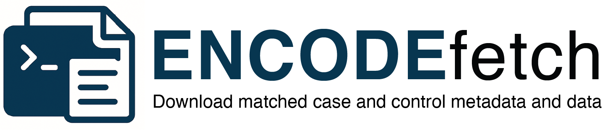

# ENCODEfetch 

[](https://pypi.org/project/encodefetch/)
[](LICENSE)
[](https://github.com/khan-lab/ENCODEfetch/actions)

**ENCODEfetch** is a command-line tool and Python package for retrieving matched case–control datasets and standardized metadata from the [ENCODE Project](https://www.encodeproject.org).

ENCODEfetch automates:

- **Search** for ENCODE experiments by assay, target, organism, status, and more.
- **Expansion of matched controls** using `possible_controls`.
- **File retrieval** (FASTQ, BAM, BED, bigWig, etc.) with filtering by status/assembly.
- **Parallel downloads** with resumable transfers and Rich progress bars.
- **Standardized metadata outputs** (`manifest.tsv`, `metadata.jsonl`).
- **Plug-and-play samplesheets** for [nf-core](https://nf-co.re/) and Snakemake workflows.
- **Interactive API** returning tidy `pandas.DataFrame` objects for downstream analysis.

## 🚀 Installation

### From PyPI (recommended)

```bash
pip install encodefetch
```

### From source

```bash
git clone https://github.com/khan-lab/ENCODEfetch.git
cd ENCODEfetch
pip install -e .
```

Requires **Python 3.9+**. or newer versions.

## 🔧 Command-line usage

```bash
encodefetch --assay-title "TF ChIP-seq" \
             --target-label BRD4,SMAD3 \
             --organism "Homo sapiens" \
             --file-type fastq \
             --status released \
             --progress \
             --download \
             --threads 8 \
             --nfcore
```

### Key options

- `--accessions ENCSR123ABC,ENCSR456DEF` — fetch experiments by accession directly.
- `--assay-title` — e.g. `TF ChIP-seq`, `Histone ChIP-seq`, `ATAC-seq`, `RNA-seq`.
- `--target-label` — one or more targets (comma-separated).
- `--organism` — e.g. `Homo sapiens`, `Mus musculus`.
- `--file-type` — restrict formats (`fastq`, `bam`, `bed`, `bigWig`…).
- `--status` — default `released` (can also include `archived`).
- `--perturbed true|false` — filter perturbed experiments.
- `--download` — actually download matched files.
- `--threads` — number of worker threads (applies to metadata fetching and downloads).
- `--nfcore` / `--snakemake` — export pipeline-ready sample sheets.

Run `encodefetch --help` to see all options.

## 📦 Outputs

After a run, `outdir/` contains:

- **`manifest.tsv`** — tidy table of case/control files with metadata.
- **`metadata.jsonl`** — raw record dump (one JSON per line).
- **`files/`** — downloaded files, organized by experiment/control.
- **`nfcore_*_samplesheet.csv`** — optional nf-core samplesheet.
- **`snakemake_samples.tsv`** — optional Snakemake sample table.

## 🐍 Python API

```python
import encodefetch as ef

# Search experiments
df, recs = ef.search_experiments(
    assay_title="TF ChIP-seq",
    target_labels=["BRD4","SMAD3"],
    organism="Homo sapiens",
    file_types={"fastq"},
    status="released",
    progress=True,
    threads=8,
)

print(df.head())

# Collapse paired-end FASTQs to one row
df = ef.collapse_fastq_pairs(df)

# Write nf-core samplesheet
ef.write_samplesheet(df, "nfcore_chipseq", "nfcore_chipseq.csv")
```

## 🧬 Assay support

ENCODEfetch currently provides assay-aware normalization and exporters for:

- **ChIP-seq** (default)
- **ATAC-seq** (placeholder, ready for rules)
- **RNA-seq** (placeholder, ready for rules)

Each assay can plug in its own normalization (e.g., FASTQ collapsing, strandedness detection) and samplesheet exporters.

## 🤝 Contributing

Contributions are welcome!

- Add new **assay classes** under `encodefetch/assays/`.
- Add new **exporters** under `encodefetch/exporters/`.
- Extend metadata fields in `build_file_record`.

See [CONTRIBUTING.md](CONTRIBUTING.md) for details.

## 📜 License

MIT License © 2025 [Aziz Khan](https://github.com/asntech)

---
