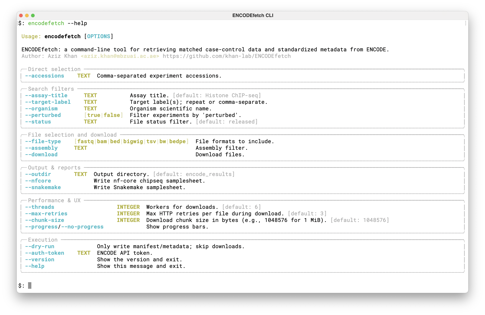

# ENCODEfetch



**ENCODEfetch** is a command-line tool and Python package for retrieving matched case-control datasets and standardized metadata from the [ENCODE Project](https://www.encodeproject.org).

It is designed for genomics workflows where you need to search ENCODE, include matched controls, keep a reproducible manifest, and hand the result to downstream pipelines such as nf-core or Snakemake.

## Key features

- Search ENCODE experiments by assay, target, organism, biosample, perturbation state, related series, status, file type, and assembly.
- Fetch specific experiment accessions from a comma-separated list or a text file.
- Expand experiment-level `possible_controls` and normalize file-level `controlled_by` links.
- Download files in parallel with resumable transfers, retries, chunk-size control, and Rich progress bars.
- Write standardized `manifest.tsv` and `metadata.jsonl` outputs for auditing and reuse.
- Collapse paired-end FASTQs into `fastq_1` and `fastq_2` columns.
- Generate samplesheets for nf-core and Snakemake workflows.
- Use the same search and export functionality from Python scripts and notebooks.

## Typical workflow

```bash
encodefetch \
  --assay-title "TF ChIP-seq" \
  --target-label BRD4 \
  --organism "Homo sapiens" \
  --file-type fastq \
  --status released \
  --metadata-only \
  --nfcore \
  --snakemake
```

This writes metadata and pipeline samplesheets without downloading FASTQs. Remove `--metadata-only` when you are ready to download files.

## Documentation map

- [Installation](installation.md): install from PyPI or source.
- [Quickstart](quickstart.md): first complete CLI and Python examples.
- [Command Line](cli.md): all user-facing options and common command patterns.
- [Python API](api.md): public functions, return values, and notebook use.
- [Exporters](exporters.md): nf-core, Nextflow/nf-core, Snakemake, and control strategies.
- [Outputs](outputs.md): manifest, metadata, downloaded files, and samplesheet columns.
