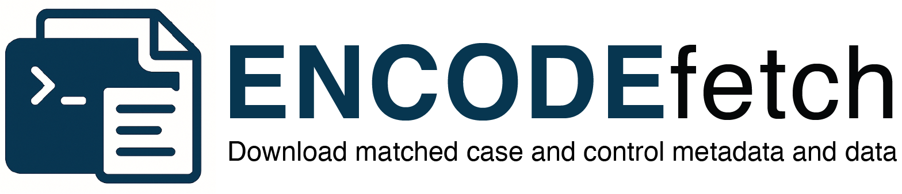

# ENCODEfetch

**ENCODEfetch** is a command-line tool and Python package for retrieving matched case–control datasets and standardized metadata from the [ENCODE Project](https://www.encodeproject.org).

## Key features

- 🔎 Search experiments by assay, target, organism, status, etc.
- 🧪 Automatically match experiments with their **controls**.
- 📂 Retrieve files (FASTQ, BAM, BED, bigWig…).
- 🚀 Multi-threaded downloads with resumable transfers and Rich progress.
- 📊 Export standardized metadata (`manifest.tsv`, `metadata.jsonl`).
- 🧬 Generate pipeline-ready samplesheets for **nf-core** and **Snakemake**.
- 🐍 Python API for use in notebooks and scripts.

Project repo: [github.com/khan-lab/ENCODEfetch](https://github.com/khan-lab/ENCODEfetch)
